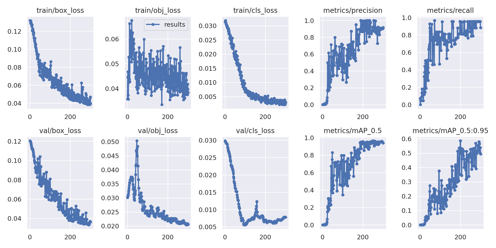
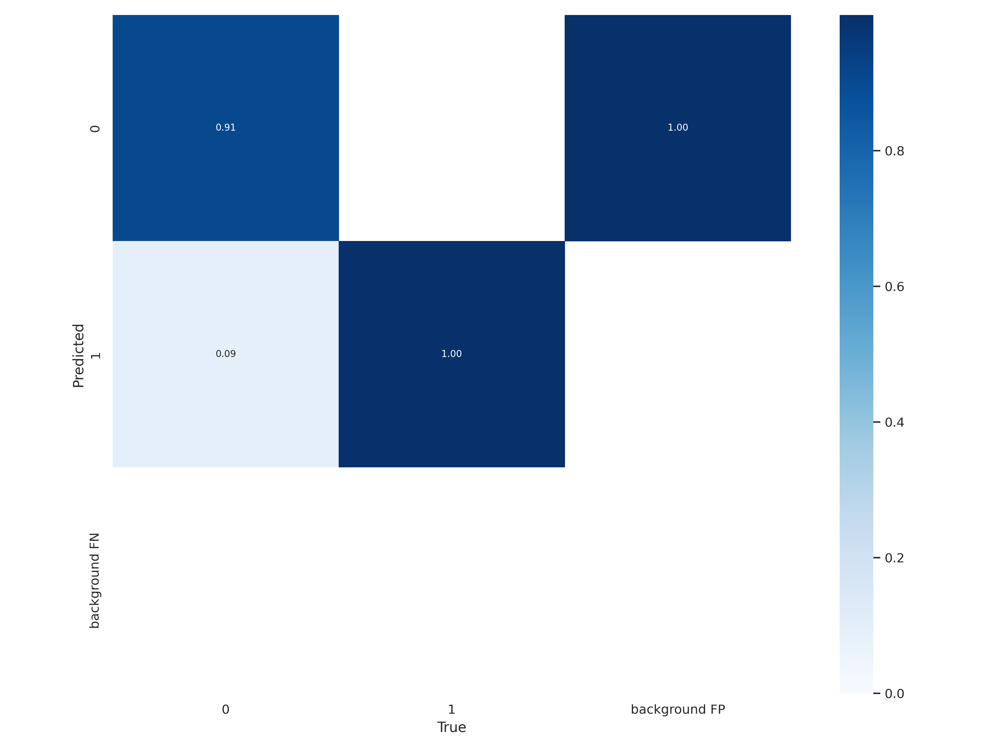
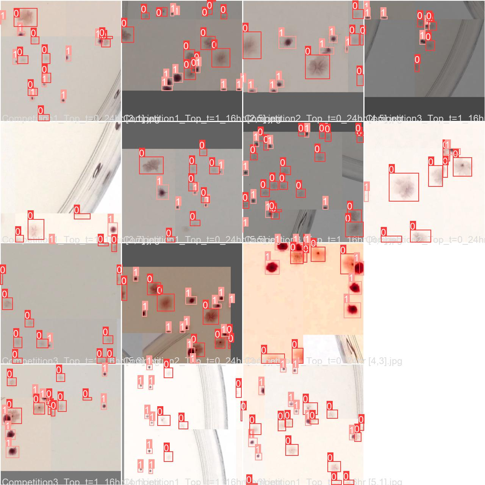
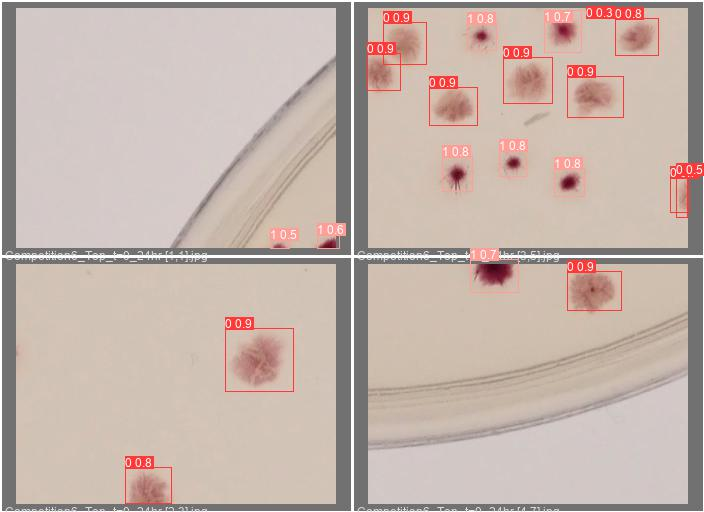

# Pilot run

The network was trained without augmentation on tiny subset of 14 image subparts with 4 as evaluation, and then used on whole set with prediction threshold of 65%. The results show that the training dataset should be bigger an/or enlarged by augmentation. But the results as they are are quite impresive already.

