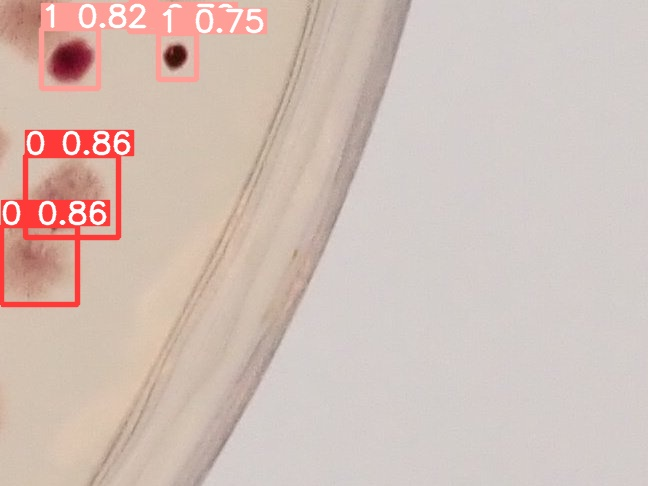
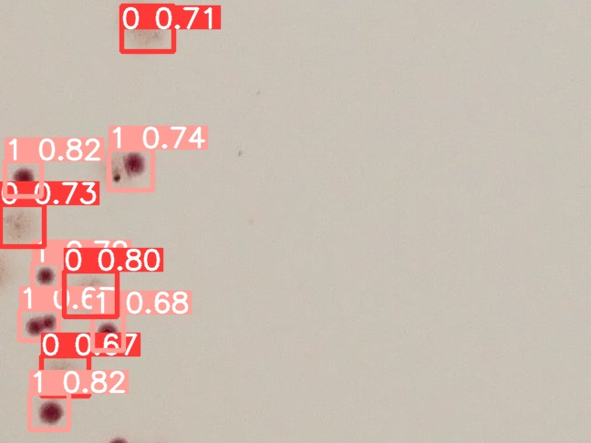
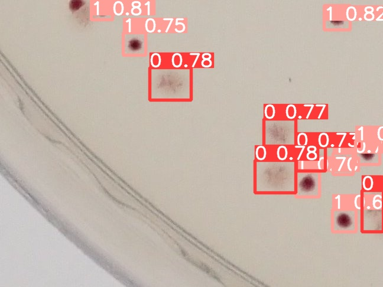
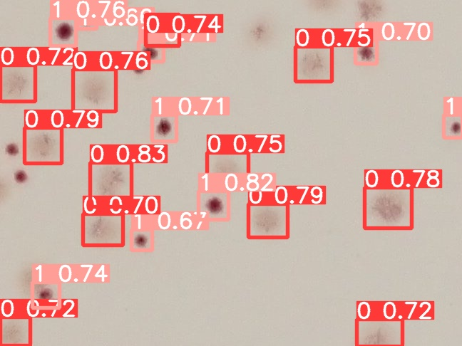
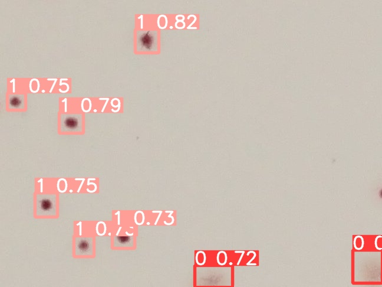

Here are results of network trained on 14 example images, without augmentation. The training dataset should be larger, and with augmentation. But results are already impresive and model "as is" can be used to ease up anotation of whole set.

The prediction threshold was set up at 65% confidence.

