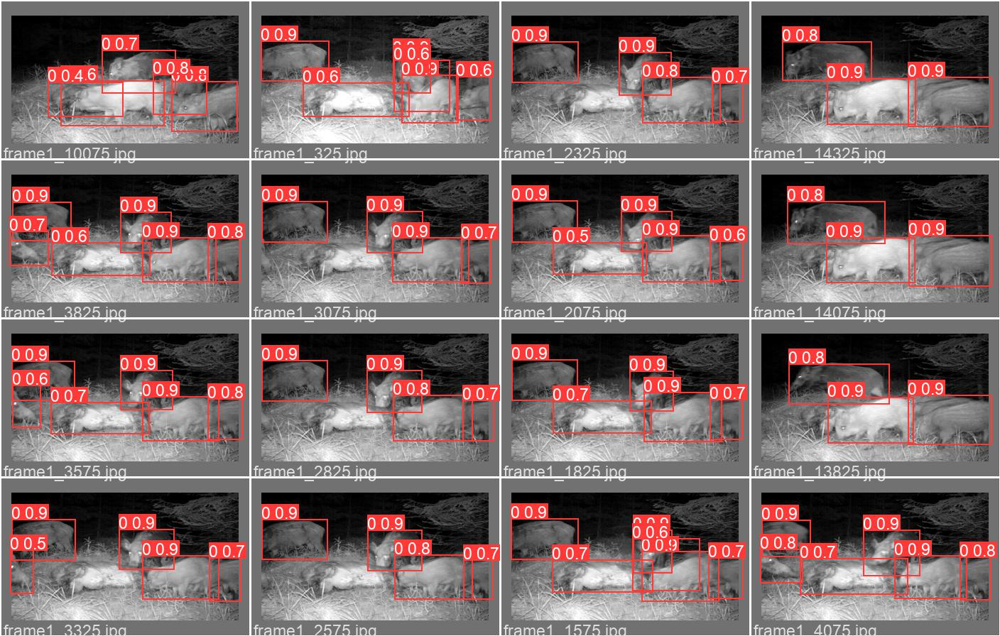

[](https://zenodo.org/badge/latestdoi/481875886)

# SciCount
SciCount is tool focused on counting and classifying of objects in image-like data and scientific images, with training and example datasets. In it core it is YOLO V5 made by [Ultralytics](https://github.com/ultralytics/yolov5) (authored by [Glenn Jocher](https://www.linkedin.com/in/glenn-jocher/)), without which it would be impossible to apply our approaches on scientific data.

## Motivation

The scope of work for this project is to ease up image analysis for infectious disease research and monitoring. The aim is to utilize modern machine learning methods to create tools used for both disease monitoring in word and under the microscope. The common theme is data preparation and selection, object and event detection, counting, and classification. The project is planned for the communities and with thier direct involvment. 

The deep learning part of machine learning is making great progress and it is time to use the newest approaches and leverage them for research. It is necessary to be careful when using scientific data with "black boxes" so detailed use-case documentation with training set is necessary. 

# Goals

* Publish models with training datasets for encreased re-usability
* Provide training materials for each community
* Test models with diffeent noise and artifacts for esabilishing of limitations
* Provide strategies for data cleaning
* Plan training workshops and fedback sessions.

## Models

The development si done as collaboration of three scientific communities fro University of Chemistry and Technology in Prague, Czech University of Life Science Prague and Science Faculty of Charles University. Each community aims to have specific workflow for its needs based on YOLO network or any other usable classical image analyis or deep learning approach.

**Wildlife monitoring** (Czech University of Life Science Prague)
In the macroscopic world, wild animals, especially non-native species, are considered potential vectors of diseases. Camera traps became common practice in wildlife monitoring in the past decades producing hundreds of hours of videos. The videos are usually manually inspected for the presence of a focal group of species. No dedicated open-source software tool exists to help detect the animals from videos, count them or even classify them, there is potential for both filtering out of the videos without events and creating timelines of events as a result of the analysis.

Example can be found [here](https://github.com/martinschatz-cz/SciCount/tree/main/WildlifeDetection/exampleResults)



**Object counting in Microscopic data** (Science Faculty, Charles University)
In the microscopic world, we often analyze whole slides of blood smears. In non-mammalian taxa (namely in birds, reptiles, amphibians and fish) where erythrocytes are nucleated and specific molecular tools such as antibodies are missing, the data is obtained by manual analysis of the stained smears, which leads to compromised dataset sizes, significant intra and inter variability of results due to user input, and high personal time demands of the investigation. While suitable tools for object detection (of specific shapes) as stardist exists, there is not yet a dedicated tool for both user setup object detection and classification. Such a tool can be used for automatic counting and classification of various types of objects present in the blood, from erythrocytes (physiological applications) up to white blood cells (immunological applications) or parasites (parasitological applications).

Example can be found [here](https://github.com/martinschatz-cz/SciCount/tree/main/SmearCounting/wholeData)


**Object counting of bacterial colonies** (University of Chemistry and Technology in Prague)
Evaluation - such as counting, measuring, or categorization - of bacterial colonies on agar plates is one of the most common methods used in biomedical examinations, food and drug safety tests, as well as in public health. Counting is usually performed manually by technicians, which leads to error-prone and subjective results; it is also tedious, laborious, and time-intensive, therefore cost-ineffective. While there already exist some application-specific automated solutions, a workflow-driven approach with interchangeable components is needed. Modern machine learning object detection techniques approach a level of maturity on which deep learning models (DLM) are becoming suitable for evaluating scientific data. With proper training sets and data augmentation, DLMs should prove practical even without expensive imaging cameras.

Example can be found [here](https://github.com/martinschatz-cz/SciCount/tree/main/LTEE/pilotRun)


### Example notebooks
You can find example notebooks aplying [SciAugment](https://github.com/martinschatz-cz/SciAugment) with small test datasets in folder example_notebooks. There is reproducible example for **LTEE**, **Wildlife detection** and **Smear counting**.

More notebooks will be added in future.

## Training
Importing part of high usability is good training materials with step by step tutorials and case-studies. From specific approaches as semi-supervised learning up to case studies for each published models - which will help with transfer learning use-cases or reusing of whole approach for completely or partialy new data.

### Augmentation
The most important part of creating robust model is augmentation - preparing your images of all the possibilities that can happen to our images during acquisition. In principle, for RGB images it is quite easy and well described (incredible review here: [https://github.com/AgaMiko/data-augmentation-review](https://github.com/AgaMiko/data-augmentation-review) by [AgaMiko](https://github.com/AgaMiko)). For scientific data and data for micrsocopes we will need bit more different setup for augmentation, and much more controll over them.

Our support package for augmentation of scientific images is available here: [SciAugment](https://github.com/martinschatz-cz/SciAugment)

#### Scientific Images
Our images should have color calibration, and lens corrections, so even though they might be RGB, there is no possibility for channel shifts or RGB shifts. However we may consider any brightness, contrast, blur or movement transformations. All our images should be generated in way we can say what augmentation was used (naming convention) so we can check the results later.

From Albumentation we may consider:
* HorizontalFlip
* RandomBrightnessContrast
* MultiplicativeNoise
* VerticalFlip
* Blur
* Transpose
* RandomRotate90
* ShiftScaleRotate
* RandomBrightnessContrast

We should also consider and implement:

* Brightness values shift (due to over/under exposure)
* Specifc gaussian blur (lower depth of field due to lower aperture)
* Poisson noise
* LowPass filter to simulate OTF

#### Microscopic Images
Augmentation for microscopic images are much more challenging due to different way of how images are created and saved and since we are bound by limits of optics. Each of our channel is representing data of its own, can be shifted (due to physical color shift) and can have shifted brightness (if not corrected). So far nice explanation can be found in [Pete Bankhead](https://github.com/petebankhead) *Analyzing fluorescence microscopy images with ImageJ* online book: chapter [Simulating image formation](https://petebankhead.gitbooks.io/imagej-intro/content/chapters/macro_simulating/macro_simulating.html)

We should consider:
* the size of the PSF (related to the objective lens NA and microscope type)
* the amount of fluorescence being emitted from the brightest region
* the amount of background (from stray light and other sources)
* the exposure time (and therefore number of detected photons)
* the detector’s offset
* the detector’s gain
* the detector’s read noise
* camera binning
* bit-depth

So far I didnt find any other mentions or code to properly augment training data that cmae from microscopes, and I am happy to learn more if you know any sources.

## Available data

### Ours

### External
**[Chula-RBC-12 Dataset is a dataset of red blood cell](https://github.com/Chula-PIC-Lab/Chula-RBC-12-Dataset)**
Chula-RBC-12 Dataset is a dataset of red blood cell (RBC) blood smear images used in "Red Blood Cell Segmentation with Overlapping Cell Separation and Classification from an Imbalanced Dataset", containing 12 classes of RBC types consisting of 706 smear images that contain over 20,000 RBC cells. The dataset was collected at the Oxidation in Red Cell Disorders Research Unit, Chulalongkorn University in 2019 using a DS-Fi2-L3 Nikon microscope at 1000x magnification.

Data set is in JPEG (unspecified loss compresion), with unspecified form of labeling, it contains text and graphics objects in 70% of images, but about 30% of images are usable for object counting training. 

## Interoperability, Re-usability and Sensitive Data

### Re-usability

We aim for high interoperbility, for this thi first step is to use Python, the second is precise case-study documentation and research data management. Scientic images can be tough to work with and use together with complex tools. There already exist Ethics quide for image analysis, and we will fully respect it and strive to go even further.

First we need to know with what kind of data we are working and what to respect. In general, we can describe scientific images as data that have one or more proprties:
* Brightness value have some specific, calibrated meaning
* Multi channel data
* More than 8-bit values
* Signed values
* Specific pixel size
* Speciic voxel size
* Correction for lens characteristics
* Bit depth change can destroy meaning of data
* Brightness distribution

And they might contain artifact:
* From improper data format use (should not happen)
* From imaging method (interference or due to mathematical reconstruction)
* From data coruption

All this needs to be taken into account, reported and kept together with tools. Because workflow designed on calibrated 16-bit 3channel data might lead to nonsense results when used on 8-bit data.

### Interoperability
There already exists tools that can potentialy use our models in their frameworks or workflows. Here is a list:
* [BioImage IO](https://bioimage.io/#/) is a dataset and model repository, that aims for high Interoperability between softwares. We aim to publish there final results.
* [Make Sense](https://github.com/SkalskiP/make-sense) have possibility to upload model.
* [MegaDetector GUI](https://github.com/petargyurov/megadetector-gui) has a future goal to train and use custom models.
* [Zamba](https://github.com/drivendataorg/zamba) aims for animal classification, and has possibility to use other models.

### Sensitive Data

Scientific data are often sensitive, and it can easily happen that we are not allowed to share the data with anyone because of licencing, data rights or because they may contain privat information. In this case we often need to work with local resources. To balance out the ease of training and learning and use on local computing resources we use two anotation tools.

[Roboflow](https://github.com/roboflow-ai/roboflow-python) and [Make Sense](https://github.com/SkalskiP/make-sense) both aim to be tools for anotating data, and both to some level provide the possibility of not sharing data.

## About us

[Martin Schätz](https://orcid.org/0000-0003-0931-4017), 
[Lukáš Mrazík](https://orcid.org/0000-0002-8847-5697), 
[Karolina Mahlerová](https://orcid.org/0000-0001-7970-485X), 

# How to cite

## SciCount

```
@MISC{Schatz2022-SciCount,
  title     = "{martinschatz-cz/SciCount}: v1.0.0 with reusable example
               notebooks",
  author    = "Sch{\"a}tz, Martin and Mraz{\'\i}k, Luk{\'a}{\v s} and
               M{\'a}hlerova, Karolina",
  abstract  = "The first version contains an example of augmentation of
               scientific data and object detection with YOLO\_v5 on colony
               counting (2 classes), object counting in blood smears (can be
               used as semisupervised learning for faster annotation), and
               wildlife detection from night records with a camera trap.",
  publisher = "Zenodo",
  year      =  2022
}
```

## SciAugment
```
@MISC{Schatz2022-SciAugment,
  title     = "{martinschatz-cz/SciAugment}: v0.1.0",
  author    = "Sch{\"a}tz, Martin",
  abstract  = "The whole tool was rewritten as a class, and two options for
               prepared augmentations were set up. Everything is shown in the
               example Google Colab notebook on a small included annotated
               (YOLO) image dataset.",
  publisher = "Zenodo",
  year      =  2022
}
```
